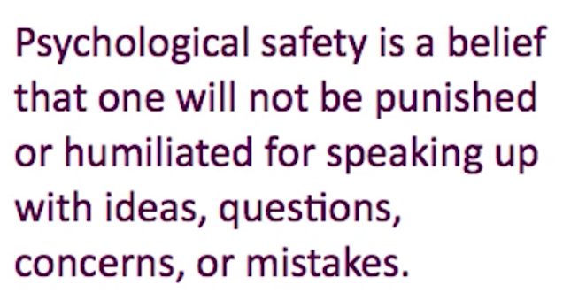

# Psychological safety

## Building high performance team series

Before I realized, my interest in software engineering and building quality software lead me to having a passion in building high performance team.

In pursuing it, I stumbled on to how _Psychological safety_ is so important in building a high performance team.

In this post, I am going to put down my learnings, observations and materials that helped me understand this concept.

### Understanding Psychological safety

As much as it sounds like a hifi term, every individual would have definitely experienced it.

>It is that situation when working with a group of people where you find yourselves comfortable to share your thoughts, ideas and opinions.

> where you feel you are accepted and respected.

> where you don't have to be worried about being ridiculed, humiliated or punished

Chances are some of us would have experienced it several times in their work life. Sometimes where they just occurred accidentally (more fortunately) or in other occasions after spending a good amount of time within the same working group.

Either way it would have been the most productive working group. Most of us will have some nice memories of such working groups that we cherish thinking about every now and then.

The challenge however is to understand how to create a environment that fosters such a set up.

[//]: # (A definition of it given by [Amy C. Edmondson](https://g.co/kgs/z2Lcwf))

[//]: # ()

[//]: # (She gave a inspirational [TED talk on this topic](https://www.youtube.com/watch?v=LhoLuui9gX8).)

### How to create a environment for Psychological safety?

[Amy C. Edmondson](https://g.co/kgs/z2Lcwf) a notable thought leader in her [TED talk "Building a psychologically safe workplace"](https://www.youtube.com/watch?v=LhoLuui9gX8) outlines a set up that fosters psychological safety.

* Frame the work as learning problem and not as execution problem

* Acknowledge your own fallibility

* Model curiosity

Much details about these paths are explained in her TED talk. There should be several ways to go about aligning to the path. Some of the principles that could help achieve it are,

* Define the problem and the outcome
Explain only the perceived problem and potential outcome to the team. Let the team 
  * Creates room for the team to innovate
  * Puts ownership to the team
  * Motivates the team to achieve the goal
  *

* Supporting the team (instead of solving for them)

* Clearly defined goal

* Autonomy in planning and execution

### Some clues

The following vocabulary can help developing listening skills around psychological safety.

#### Sounds of traps in your team

>"I always felt like I had to prove myself"

>"I always felt like I had to be careful not to make mistakes around them"

>"People would try to show authority by speaking louder or talking over each other"

#### Good signals

>"we all felt like we could say anything to each other"
>"No one worried that the rest of the team was judging them"

#### Myth

> "building the best teams meant combining the best people"

###  
"The right norms, in other words, could raise a group’s collective intelligence, whereas the wrong norms could hobble a team, even if, individually, all the members were exceptionally bright."

‘‘But if only one person or a small group spoke all the time, the collective intelligence declined.’’

the norms — the fights over leadership, the tendency to critique — put her on guard. Whereas the norms — enthusiasm for one another’s ideas, joking around and having fun — allowed everyone to feel relaxed and energized.

knowing that their colleagues have their back.

## Impact on Psychological safety on team performance

image credit [www.aleanjourney.com](http://www.aleanjourney.com/2011/04/stages-of-high-performance-teams.htmlhttp://www.aleanjourney.com/2011/04/stages-of-high-performance-teams.html)

https://www.youtube.com/watch?v=LhoLuui9gX8
https://www.nytimes.com/2016/02/28/magazine/what-google-learned-from-its-quest-to-build-the-perfect-team.html?_r=0
