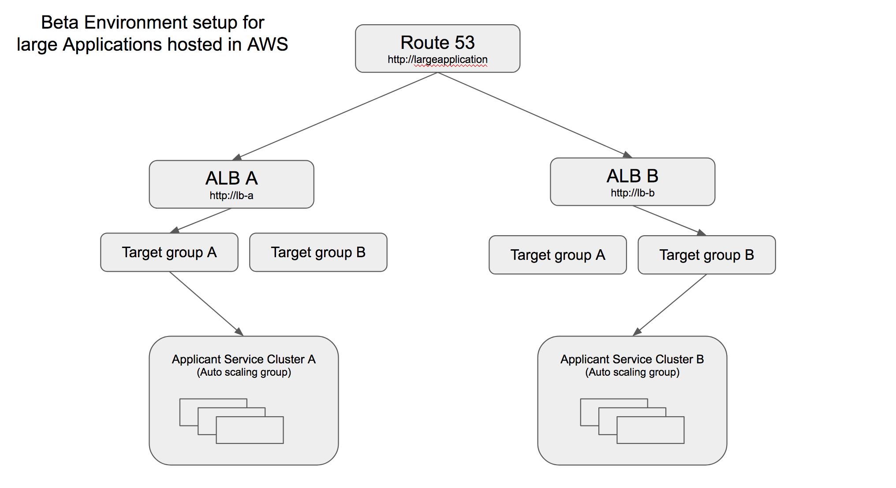
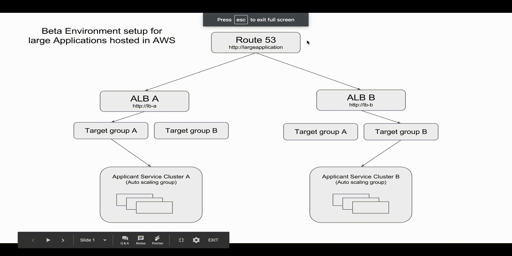

## BETA Environment configuration for large scale application hosted on AWS

This is in continuation to the [previous post](http://humblelistener.github.io/2017/05/04/When-you-lose-confidence-in-code/), I wrote about a situation where it was getting hard to deploy a particular application. I also mentioned how having a blue green like beta environment would help validate the behaviours of the system in near realtime without having a big impact on neither business or your end users.

### AWS Weighted load balancing
The solution proposed leveraged on the capability of load balancers to weigh the load to two different server cluster so that the behaviour can be validated in the production without great impact.

With that in mind in the time in between I was spiking different options in AWS ecosystem to understand how such an architecture can be built.

#### Load balancers that cannot do custom weighing
This was a big surprise, I was hoping a lot on AWS [Application Load Balancer](https://aws.amazon.com/elasticloadbalancing/applicationloadbalancer/) or [Elastic Load Balancer](https://aws.amazon.com/elasticloadbalancing/classicloadbalancer/) to be able to support this easily.

> Isn't it a fair expectation to have weighted routing (weighted round robin anyone?) in a load balancer AWS?

To my surprise, neither ALB or ELB in its current form is capable of doing it. Seriously yes, I contacted support and they confirmed it.

However, their managed DNS service - [Route 53](https://aws.amazon.com/route53/) supports it. While it is a relief, given we are invested in AWS at the moment, it does come with the limitation that DNS caching can be tricky, the residual connections to a server that is rolled back is possible.

### The winning solution design
So after being surprised by load balancers in AWS and with the only option of doing it with a combination of Route 53 and ALB's, this is what we came up with.

The gif provides a better picture on spike and how it will work.

### What are the stated advantages

I did briefly touch about it in the [previous post](http://humblelistener.github.io/2017/05/04/When-you-lose-confidence-in-code/). In the hindsight, it is easy to explain why it is required for us now for our line of business application and how it might apply to you,

* Reduce impact of business when improving the system.
* Provide a safe environment for technical improvements on the platform.
* A ground work for to enable iterating on the software effectively.

So now that spike is done, the next step is the big test. We have to create a build and deployment pipeline to deploy in such an environment. Wish me good luck with it. I will share my experience as I finish each step.

In the meanwhile, If you find this useful or have any better ways of achieving this please do leave a note and I will be very happy.

Till then, Cheers!
